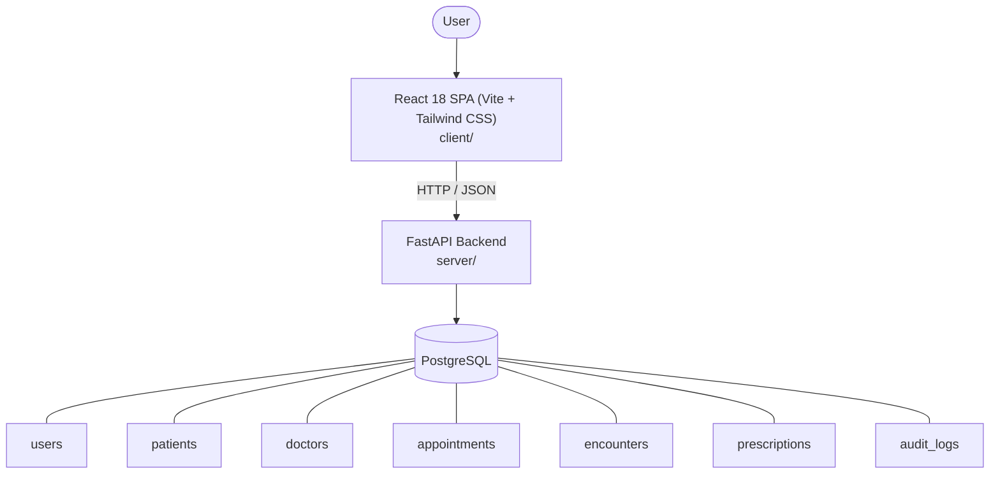

# Architecture

_Auto-generated by the SDLC Assistant from the generated codebase and the approved Feature Spec (latest: SCRUM-250). Regenerated on each push._

## System Diagram

## Tech Stack
- **language**: Python 3.11
- **backend_framework**: FastAPI
- **orm**: SQLAlchemy 2.x
- **database**: PostgreSQL
- **frontend**: React 18 SPA (Vite + Tailwind CSS)
- **cloud_provider**: GCP Cloud Run
- **constitution_section_4_followed**: True

## Backend Modules (server/)
- server/__init__.py
- server/api/__init__.py
- server/api/v1/__init__.py
- server/api/v1/appointments.py
- server/api/v1/audit_logs.py
- server/api/v1/auth.py
- server/api/v1/doctors.py
- server/api/v1/encounters.py
- server/api/v1/patients.py
- server/core/__init__.py
- server/core/config.py
- server/core/database.py
- server/core/security.py
- server/main.py
- server/models/__init__.py
- server/models/appointment.py
- server/models/audit_log.py
- server/models/doctor.py
- server/models/encounter.py
- server/models/patient.py
- server/models/prescription.py
- server/models/user.py
- server/schemas/__init__.py
- server/schemas/appointment.py
- server/schemas/audit_log.py
- server/schemas/doctor.py
- server/schemas/encounter.py
- server/schemas/patient.py
- server/schemas/user.py
- server/tests/__init__.py
- server/tests/conftest.py
- server/tests/test_appointments.py
- server/tests/test_auth.py
- server/tests/test_doctors.py
- server/tests/test_encounters.py
- server/tests/test_patients.py

## Frontend Modules (client/)
- (no client/ files found yet)

## API Endpoints
- POST /api/v1/auth/login
- POST /api/v1/patients
- GET /api/v1/patients
- POST /api/v1/doctors
- GET /api/v1/doctors/{id}/availability
- POST /api/v1/appointments
- POST /api/v1/encounters

## Data Model
- users
- patients
- doctors
- appointments
- encounters
- prescriptions
- audit_logs
